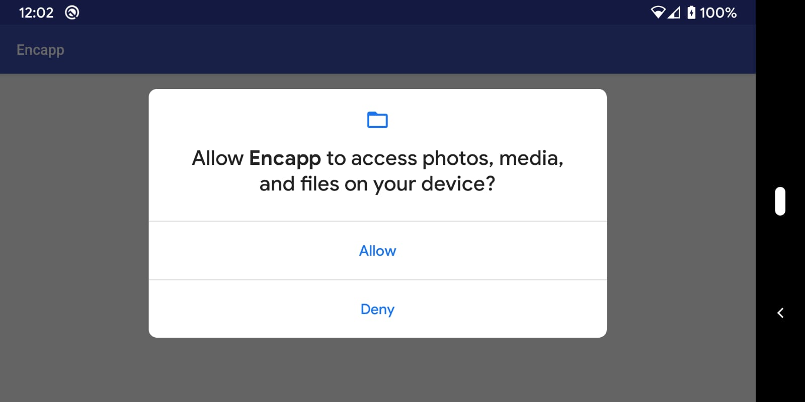

# encapp development

This page provides instructions on how to build and develop encapp, including using the tool without the encapp.py script.

For a description on how to use the tool, check [README.md](README.md).


# 1. Prerequisites

In order to do encapp development, you need:
* android sdk setup and environment variables set
* android ndk


# 2. Operation

## 2.1. set up the android SDK and NDK in the `local.properties` file.

Create a `local.properties` file with valid entries for the `ndk.dir` and
`sdk.dir` variables.

```
$ cat local.properties
ndk.dir: /opt/android_ndk/android-ndk-r19/
sdk.dir: /opt/android_sdk/
```

Note that this file should not be added to the repo.

## 2.2. build the encapp app

```
$ ./gradlew clean
$ ./gradlew build
...
BUILD SUCCESSFUL in 6s
61 actionable tasks: 5 executed, 56 up-to-date
```

## 2.3. run the `setup.sh` script to install encapp in your android device.

```
$ ./setup.sh
...
Installing APK 'com.facebook.encapp-v1.0-debug.apk' on 'Pixel - 10' for app:debug
Installed on 4 devices.

BUILD SUCCESSFUL in 14s
31 actionable tasks: 3 executed, 28 up-to-date
```

## 2.4. run a quick encoding experiment with the app

Install the app.
```
$ adb install ./app/build/outputs/apk/debug/com.facebook.encapp-v1.0-debug.apk
$ adb shell cmd package list package |grep encapp
package:com.facebook.encapp
```

Run the `list_codecs` function.

Note that, for the very first time you run the instrumentation codecs, the
device will ask you for permission to access to `/sdcard/`.

Figure 1 shows 

```
$ adb shell am start -W -e list_codecs a -e ui_timeout 3 com.facebook.encapp/.MainActivity
Starting: Intent { act=android.intent.action.MAIN cat=[android.intent.category.LAUNCHER] cmp=com.facebook.encapp/.MainActivity (has extras) }
Status: ok
LaunchState: COLD
Activity: com.facebook.alohaapps.launcher/com.facebook.aloha.app.home.touch.HomeActivity
TotalTime: 1479
WaitTime: 1482
Complete
```

```
$ adb shell cat /sdcard/codecs.txt
--- List of supported encoders  ---

        MediaCodec {
            name: OMX.qcom.video.encoder.avc
            type {
                mime_type: video/avc
                max_supported_instances: 24
                color {
                    format: 2141391878
                }
                color {
                    format: 2141391876
                }
                color {
                    format: 2141391872
                    name: COLOR_QCOM_FormatYUV420SemiPlanar
                }
                color {
                    format: 2141391881
                }
                color {
                    format: 2141391882
                }
                color {
                    format: 2141391880
                }
                color {
                    format: 2141391879
                }
                color {
                    format: 2130708361
                    name: COLOR_FormatSurface
                }
                color {
                    format: 2135033992
                    name: COLOR_FormatYUV420Flexible
                }
                color {
                    format: 21
                    name: COLOR_FormatYUV420SemiPlanar
                }
                profile {
                    profile: 65536
                    level: 65536
                }
                profile {
                    profile: 1
                    level: 65536
                }
                profile {
                    profile: 2
                    level: 65536
                }
                profile {
                    profile: 524288
                    level: 65536
                }
                profile {
                    profile: 8
                    level: 65536
                }
            }
        }

        MediaCodec {
            name: OMX.qcom.video.encoder.h263sw
            type {
...
```

# 3. run a quick encoding experiment with the app

## 3.1. small qcif encoding

First, choose one of the codecs from step 4. In this case, we will use `OMX.google.vp8.encoder`.

Push the (raw) video file to be encoded into the device. Note that we are using a QCIF video (176x144).
```
$ wget https://media.xiph.org/video/derf/y4m/akiyo_qcif.y4m -O /tmp/akiyo_qcif.y4m
$ ffmpeg -i /tmp/akiyo_qcif.y4m -f rawvideo -pix_fmt yuv420p /tmp/akiyo_qcif.yuv
$ adb push /tmp/akiyo_qcif.yuv /sdcard/
```

Now run the vp8 encoder (`OMX.google.vp8.encoder`):
```
$ adb shell am start -W -e enc OMX.google.vp8.encoder -e ref_res 176x144 -e file /sdcard/akiyo_qcif.yuv com.facebook.encapp/.MainActivity
...
```

And pull the encoded file:
```
$ adb pull /sdcard/encapp_<UNIQUE_ID>.webm /tmp/
$ ffprobe -i /tmp/encapp_<UNIQUE_ID>.webm
...
  Duration: 00:00:02.93, start: 0.000000, bitrate: 113 kb/s
    Stream #0:0: Video: vp8, yuv420p(tv, smpte170m/smpte170m/bt709, progressive), 176x144, SAR 1:1 DAR 11:9, 30 fps, 30 tbr, 1k tbn, 1k tbc (default)
```

## 3.2. hd encoding

Now, let's run the h264 encoder in an HD file. We will just select the codec ("h264"), and let encapp choose the actual encoder.

```
$ wget https://media.xiph.org/video/derf/y4m/KristenAndSara_1280x720_60.y4m -O /tmp/KristenAndSara_1280x720_60.y4m
$ ffmpeg -i /tmp/KristenAndSara_1280x720_60.y4m -f rawvideo -pix_fmt yuv420p /tmp/KristenAndSara_1280x720_60.yuv
$ adb push /tmp/KristenAndSara_1280x720_60.yuv /sdcard/
```

```
$ adb shell am start -W -e enc OMX.google.vp8.encoder -e ref_res 1280x720 -e file /sdcard/KristenAndSara_1280x720_60.yuv -e bit 100 -e mod cbr -e fps 60 -e ifsize unlimited -e skfr false -e debug false -e ltrc 1 com.facebook.encapp/.MainActivity
...
```

## 4. Regression test

encapp.verify.py will run through the tests defined in 'tests/' folder and try to verify:
    * bitrate
    * key frames
    * temporal layers
    * long temporal references (Qalcomm ltr)

Just like encapp.py overrides for input and encoder is vailable.
Run the test just like they are defined:

'''
$ encapp_verify.py
'''

Override the input, encoding resolution and codec:
'''
$ encapp_verify.py -i /media/johan/data/media_encapp/<encoded>.mp4  -os 1920x1080 -c encoder.avc
'''

Overrride input and run specific test:
'''
$ encapp_verify.py -i /tmp/KristenAndSara_1280x720_60.yuv -is 1280x720 -if 30 -os 1280x720 -of 30 -t <PATH>/encapp/tests/simple.qcif.json
'''

For a raw input both input and output resolution and fps needs to be specified even if raw buffer will not allow scaling (which surface encoding does).
