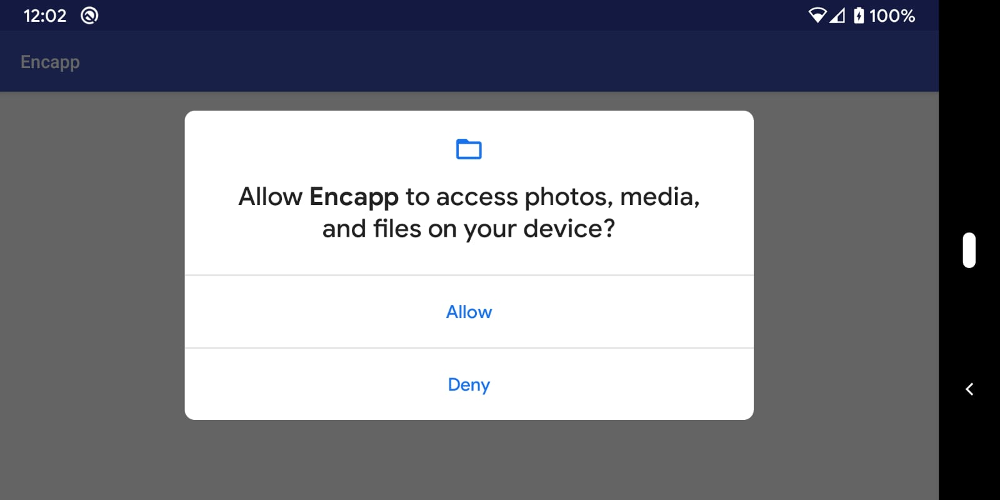

# encapp
Easy way to test video encoders in Android in large scale.

This tool provides an easy way to test an android video encoder by easily combining parameters like:

* codecs
* bitrate
* framerate
* i-frame interval
* coding mode

encapp also has support for dynamically changing framerate, bitrate, and ltr.
This is described in `scripts/offline_transcoding.sh`.


## 1. Prerequisites

* adb connection to the device being tested.
* ffmpeg with decoding support for the codecs to be tested
* android sdk setup and environment variables set
* android ndk


## 2. Operation

(1) set up the android SDK and NDK in the `local.properties` file.

Create a `local.properties` file with valid entries for the `ndk.dir` and
`sdk.dir` variables.

```
$ cat local.properties
ndk.dir: /opt/android_ndk/android-ndk-r19/
sdk.dir: /opt/android_sdk/
```

Note that this file should not be added to the repo.

(2) build the encapp app

```
$ ./gradlew clean
$ ./gradlew build
...
BUILD SUCCESSFUL in 6s
61 actionable tasks: 5 executed, 56 up-to-date
```

(3) run the `setup.sh` script to install encapp in your android device.

```
$ ./setup.sh
...
Installing APK 'com.facebook.encapp-v1.0-debug.apk' on 'Pixel - 10' for app:debug
Installed on 4 devices.

BUILD SUCCESSFUL in 14s
31 actionable tasks: 3 executed, 28 up-to-date
```

(4) run a quick encoding experiment with the app

Install the app.
```
$ adb install ./app/build/outputs/apk/debug/com.facebook.encapp-v1.0-debug.apk
$ adb shell cmd package list package |grep encapp
package:com.facebook.encapp
```

Install the instrumented test infra.
```
$ ./gradlew installDebugAndroidTest
$ adb shell pm list instrumentation
...
instrumentation:com.facebook.encapp.test/android.support.test.runner.AndroidJUnitRunner (target=com.facebook.encapp)
...
```

Run the `list_codecs` function.

Note that, for the very first time you run the instrumentation codecs, the
device will ask you for permission to access to `/sdcard/`.

Figure 1 shows 

```
$ adb shell am instrument -w -r -e list_codecs a -e test_timeout 20 -e class com.facebook.encapp.CodecValidationInstrumentedTest com.facebook.encapp.test/android.support.test.runner.AndroidJUnitRunner
INSTRUMENTATION_STATUS: class=com.facebook.encapp.CodecValidationInstrumentedTest
INSTRUMENTATION_STATUS: current=1
INSTRUMENTATION_STATUS: id=AndroidJUnitRunner
INSTRUMENTATION_STATUS: numtests=1
INSTRUMENTATION_STATUS: stream=
com.facebook.encapp.CodecValidationInstrumentedTest:
INSTRUMENTATION_STATUS: test=automateValidation
INSTRUMENTATION_STATUS_CODE: 1
INSTRUMENTATION_STATUS: class=com.facebook.encapp.CodecValidationInstrumentedTest
INSTRUMENTATION_STATUS: current=1
INSTRUMENTATION_STATUS: id=AndroidJUnitRunner
INSTRUMENTATION_STATUS: numtests=1
INSTRUMENTATION_STATUS: stream=.
INSTRUMENTATION_STATUS: test=automateValidation
INSTRUMENTATION_STATUS_CODE: 0
INSTRUMENTATION_RESULT: stream=

Time: 17.285

OK (1 test)


INSTRUMENTATION_CODE: -1
```

```
$ adb logcat |grep encapp |grep Codec:
...
11-13 12:06:41.004  2789  2789 D encapp  : Codec:c2.android.aac.encoder type: audio/mp4a-latm
11-13 12:06:41.004  2789  2789 D encapp  : Codec:OMX.google.aac.encoder type: audio/mp4a-latm
11-13 12:06:41.004  2789  2789 D encapp  : Codec:c2.android.amrnb.encoder type: audio/3gpp
11-13 12:06:41.005  2789  2789 D encapp  : Codec:OMX.google.amrnb.encoder type: audio/3gpp
11-13 12:06:41.005  2789  2789 D encapp  : Codec:c2.android.amrwb.encoder type: audio/amr-wb
11-13 12:06:41.005  2789  2789 D encapp  : Codec:OMX.google.amrwb.encoder type: audio/amr-wb
11-13 12:06:41.005  2789  2789 D encapp  : Codec:c2.android.flac.encoder type: audio/flac
11-13 12:06:41.005  2789  2789 D encapp  : Codec:OMX.google.flac.encoder type: audio/flac
11-13 12:06:41.006  2789  2789 D encapp  : Codec:c2.android.opus.encoder type: audio/opus
11-13 12:06:41.006  2789  2789 D encapp  : Codec:c2.qti.avc.encoder type: video/avc
11-13 12:06:41.006  2789  2789 D encapp  : Codec:OMX.qcom.video.encoder.avc type: video/avc
11-13 12:06:41.006  2789  2789 D encapp  : Codec:c2.qti.hevc.encoder type: video/hevc
11-13 12:06:41.006  2789  2789 D encapp  : Codec:OMX.qcom.video.encoder.hevc type: video/hevc
11-13 12:06:41.006  2789  2789 D encapp  : Codec:c2.qti.vp8.encoder type: video/x-vnd.on2.vp8
11-13 12:06:41.007  2789  2789 D encapp  : Codec:OMX.qcom.video.encoder.vp8 type: video/x-vnd.on2.vp8
11-13 12:06:41.007  2789  2789 D encapp  : Codec:c2.android.avc.encoder type: video/avc
11-13 12:06:41.007  2789  2789 D encapp  : Codec:OMX.google.h264.encoder type: video/avc
11-13 12:06:41.007  2789  2789 D encapp  : Codec:c2.android.h263.encoder type: video/3gpp
11-13 12:06:41.007  2789  2789 D encapp  : Codec:OMX.google.h263.encoder type: video/3gpp
11-13 12:06:41.007  2789  2789 D encapp  : Codec:c2.android.hevc.encoder type: video/hevc
11-13 12:06:41.008  2789  2789 D encapp  : Codec:c2.android.mpeg4.encoder type: video/mp4v-es
11-13 12:06:41.008  2789  2789 D encapp  : Codec:OMX.google.mpeg4.encoder type: video/mp4v-es
11-13 12:06:41.008  2789  2789 D encapp  : Codec:c2.android.vp8.encoder type: video/x-vnd.on2.vp8
11-13 12:06:41.008  2789  2789 D encapp  : Codec:OMX.google.vp8.encoder type: video/x-vnd.on2.vp8
11-13 12:06:41.008  2789  2789 D encapp  : Codec:c2.android.vp9.encoder type: video/x-vnd.on2.vp9
11-13 12:06:41.009  2789  2789 D encapp  : Codec:OMX.google.vp9.encoder type: video/x-vnd.on2.vp9
...
```

(5) run a quick encoding experiment with the app

(5.a) small qcif encoding

First, choose one of the codecs from step 4. In this case, we will use `OMX.google.vp8.encoder`.

Push the (raw) video file to be encoded into the device. Note that we are using a QCIF video (176x144).
```
$ wget https://media.xiph.org/video/derf/y4m/akiyo_qcif.y4m -O /tmp/akiyo_qcif.y4m
$ ffmpeg -i /tmp/akiyo_qcif.y4m -f rawvideo -pix_fmt yuv420p /tmp/akiyo_qcif.yuv
$ adb push /tmp/akiyo_qcif.yuv /sdcard/
```

Now run the vp8 encoder (`OMX.google.vp8.encoder`):
```
$ adb shell am instrument -w -r -e key 10 -e enc OMX.google.vp8.encoder -e file /sdcard/akiyo_qcif.yuv -e test_timeout 20 -e video_timeout 3 -e res 176x144 -e ref_res 176x144 -e bit 100 -e mod cbr -e fps 30 -e ifsize unlimited -e skfr false -e debug false -e ltrc 1 -e class com.facebook.encapp.CodecValidationInstrumentedTest com.facebook.encapp.test/android.support.test.runner.AndroidJUnitRunner
...
```

And pull the encoded file:
```
$ adb pull /sdcard/omx.google.vp8.encoder_30fps_176x144_100000bps_iint10_m2.webm /tmp/
$ ffprobe -i /tmp/omx.google.vp8.encoder_30fps_176x144_100000bps_iint10_m2.webm
...
  Duration: 00:00:02.93, start: 0.000000, bitrate: 113 kb/s
    Stream #0:0: Video: vp8, yuv420p(tv, smpte170m/smpte170m/bt709, progressive), 176x144, SAR 1:1 DAR 11:9, 30 fps, 30 tbr, 1k tbn, 1k tbc (default)
```

(5.b) hd encoding

Now, let's run the h264 encoder in an HD file. We will just select the codec ("h264"), and let encapp choose the actual encoder.

```
$ wget https://media.xiph.org/video/derf/y4m/KristenAndSara_1280x720_60.y4m
$ ffmpeg -i /tmp/KristenAndSara_1280x720_60.y4m -f rawvideo -pix_fmt yuv420p /tmp/KristenAndSara_1280x720_60.yuv
$ adb push /tmp/KristenAndSara_1280x720_60.yuv /sdcard/
```

```
$ adb shell am instrument -w -r -e key 10 -e enc h264 -e file /sdcard/KristenAndSara_1280x720_60.yuv -e test_timeout 20 -e video_timeout 3 -e res 1280x720 -e ref_res 1280x720 -e bit 100 -e mod cbr -e fps 60 -e ifsize unlimited -e skfr false -e debug false -e ltrc 1 -e class com.facebook.encapp.CodecValidationInstrumentedTest com.facebook.encapp.test/android.support.test.runner.AndroidJUnitRunner
...
```


(6) run a multiple encoding experiment with the app

Run

```
$ encapp_tests.py --config sample_config.json
```

Open the `sample_config.json` file in a editor and edit the test.
example, mp4 file:

```
 [
    {
        "description": "sample",
        "input_files": [
            "red_short_hq_x264_yuv420p.mp4"
        ],
        "use_surface_enc": 1,
        "input_format": "mp4",
        "input_resolution": "1280x720",
        "codecs": [
            "hevc"
        ],
        "encode_resolutions": [
            "1280x720"
        ],
        "rc_modes": [
            "cbr"
        ],
        "bitrates": [
            3000,
            7000,
            10000
        ],
        "i_intervals": [
            0,
            1,
            10
        ],
        "i_frame_sizes": [
            "unlimited"
        ],
        "duration": 30
    }
]
```

raw file:
```
[
    {
        "description": "sample",
        "input_files": [
            "red_short_720p_nv12_2_35sec_gop-10sec.yuv"
        ],
        "use_surface_enc": 0,
        "input_format": "nv12",
        "input_resolution": "1280x720",
        "codecs": [
            "hevc"
        ],
        "encode_resolutions": [
            "1280x720"
        ],
        "rc_modes": [
            "cbr"
        ],
        "bitrates": [
            3000,
            7000,
            10000
        ],
        "i_intervals": [
            0,
            1,
            10
        ],
        "i_frame_sizes": [
            "unlimited"
        ],
        "duration": 30
    }
]
```

Definitions of the keys in the sample json file
'description':  Description of the test. It can be empty
'input_files':  A list of input files
'codecs':       A list of encoders
'encode_resolutions': A list of encoding resolutions
'rc_modes': A list of rate control modes
'bitrates': A list of encoding bitrates
'i_intervals': A list of I frame intervals
'duration':    Duration of the encoding. This is ignored when enc loop > 0
'use_surface_enc': Set to 1 use Android Mediacodec surface encoder. Default is 0
'input_format': Input video format: mp4, nv12, yuv420p
'input_resolution': Input video resolution
'i_frame_sizes': An optional parameter.
'temporal_layer_counts': Number of temporal layers
'enc_loop': The number of time looping encoding. This is used for encoding time profiling. When enc_loop is greater than 1, there is no output video

Run
This will install a prebuild apk, push the videofile and run the test.
$ encapp.py sample_config.json

To run on a specific device, use

$ encapp.py --test sample_config.json --serial [device serial number]
The script will automatically push the input files to the device.
If the input file(s) are not in the working directory, use absolute path(s)

The script saves all encoded videos and stats in an output directory per run.
Stat files are in JSON format.

If you do not want to install the prebuild apk, run
$ encapp.py --install false sample_config.json
